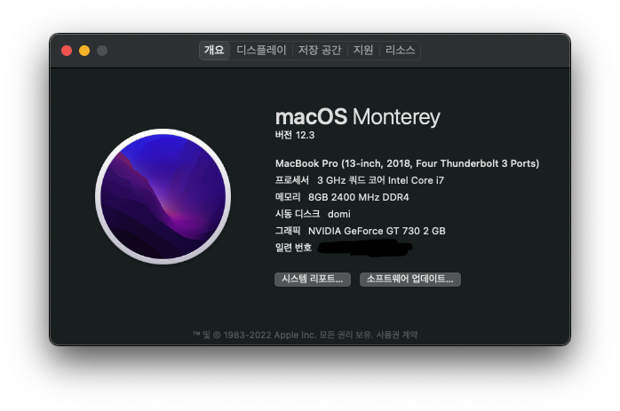

# Samsung-DM500S7A-A59-Hackintosh

## 🔎 Configuration
|      | Detail   |
| ---- | -----------------------------------------|
| Model | Samsung DM500S7A-A59|
| CPU  | i5-7400 (3.0GHz) (Kaby Lake) |
| GPU | NVIDIA GeForce GT 730 2 GB|
| Memory | 4G + 4G|
| Sound Card | Realtek ALC662|
| Network Card | Intel Wireless-AC 8265|
<!-- | Bluetooth | | -->

## 🟢 Working
- [x] Wi-Fi
- [x] Sound
- [x] Graphics

## 🔴 Not Working
- [ ] Bluetooth
- [ ] Sleep & Wake